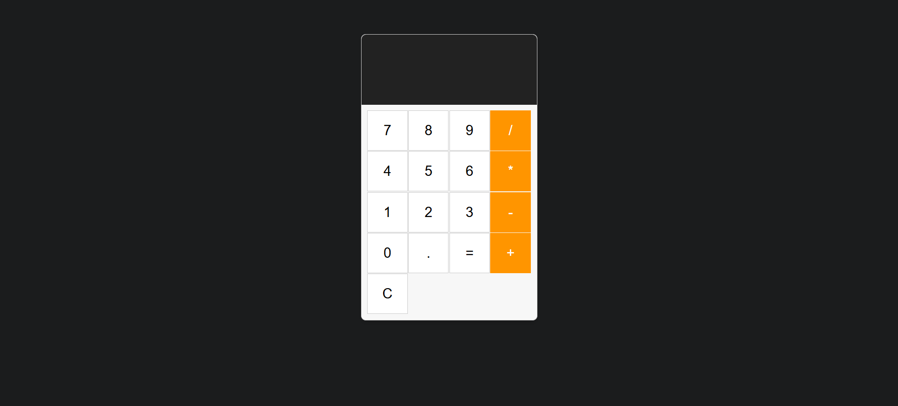

# MWAD-EXP_04-Simple-caluculator

## Date: 22-09-2025

## AIM

To develop a Simple Calculator using React.js with clean and responsive design, ensuring a smooth user experience across different screen sizes.

## ALGORITHM

### STEP 1

Create a React App.

### STEP 2

Open a terminal and run:

  <ul><li>npx create-react-app simple-calculator</li>
  <li>cd simple-calculator</li>
  <li>npm start</li></ul>

### STEP 3

Inside the src/ folder, create a new file Calculator.js and define the basic structure.

### STEP 4

Plan the UI: Display screen, number buttons (0-9), operators (+, -, \*, /), clear (C), and equal (=).

### STEP 5

Create a new file Calculator.css in src/ and add the styling.

### STEP 6

Open src/App.js and modify it.

### STEP 7

Start the development server.
npm start

### STEP 8

Open http://localhost:3000/ in the browser.

### STEP 9

Test the calculator by entering numbers and operations.

### STEP 10

Fix styling issues and refine content placement.

### STEP 11

Deploy the website.

### STEP 12

Upload to GitHub Pages for free hosting.

## PROGRAM

### Calculator.jsx

```jsx
import React, { useState } from "react";
import "./Calculator.css";

const Calculator = () => {
  const [input, setInput] = useState("");
  const [result, setResult] = useState("");

  const handleButtonClick = (value) => {
    if (value === "=") {
      try {
        setResult(eval(input) || "Error");
      } catch (e) {
        setResult("Error");
      }
    } else if (value === "C") {
      setInput("");
      setResult("");
    } else {
      setInput((prevInput) => prevInput + value);
    }
  };

  const buttons = [
    "7",
    "8",
    "9",
    "/",
    "4",
    "5",
    "6",
    "*",
    "1",
    "2",
    "3",
    "-",
    "0",
    ".",
    "=",
    "+",
    "C",
  ];

  return (
    <div className="calculator">
      <div className="display">
        <div className="input">{input}</div>
        <div className="result">{result}</div>
      </div>
      <div className="buttons">
        {buttons.map((btn, index) => (
          <button key={index} onClick={() => handleButtonClick(btn)}>
            {btn}
          </button>
        ))}
      </div>
    </div>
  );
};

export default Calculator;
```

### Calculator.css

```css
.calculator {
  width: 300px;
  margin: 50px auto;
  border: 1px solid #ccc;
  border-radius: 8px;
  box-shadow: 0 4px 8px rgba(0, 0, 0, 0.1);
  font-family: Arial, sans-serif;
  background-color: #f7f7f7;
}

.display {
  background-color: #222;
  color: white;
  padding: 20px;
  text-align: right;
  border-top-left-radius: 8px;
  border-top-right-radius: 8px;
}

.input {
  font-size: 1.5rem;
  height: 30px;
  color: #aaa;
}

.result {
  font-size: 2.5rem;
  height: 50px;
}

.buttons {
  display: grid;
  grid-template-columns: repeat(4, 1fr);
  gap: 1px;
  padding: 10px;
}

.buttons button {
  background-color: #fff;
  border: 1px solid #ccc;
  padding: 20px;
  font-size: 1.5rem;
  cursor: pointer;
  transition: background-color 0.2s;
}

.buttons button:hover {
  background-color: #ddd;
}

.buttons button:active {
  background-color: #ccc;
}

.buttons button:nth-child(4n),
.buttons button:nth-last-child(2) {
  background-color: #ff9500;
  color: white;
  border: none;
}
```

### App.jsx

```jsx
import React from "react";
import Calculator from "./Calculator";
import "./App.css";

function App() {
  return (
    <div className="App">
      <Calculator />
    </div>
  );
}

export default App;
```

## OUTPUT



## RESULT

The program for developing a simple calculator in React.js is executed successfully.
